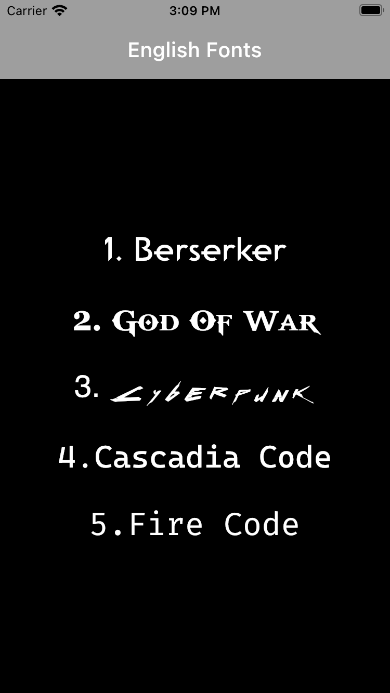
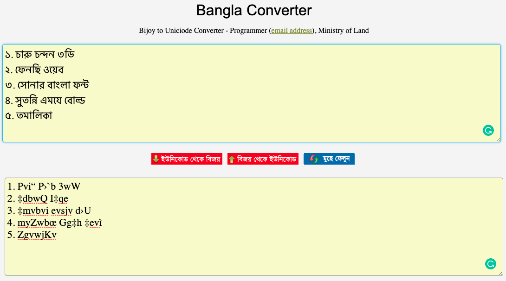

# Flutter Fonts

</img>
This repo will teach you how to use custom fronts that are available on the internet. 
Detailed description of how to use them properly in your applications are available [here](https://docs.flutter.dev/cookbook/design/fonts). 
Flutter supports the following font formats:
.ttf
.otf
 
The Bijoy fonts are downloaded from [okkhor52.com](https://okkhor52.com/)
Note: Flutter does not support .woff and .woff2 fonts for all platforms.

## Screenshots

</img>
&nbsp;&nbsp;&nbsp;&nbsp;
</img>

## Bijoy Fonts to Unicode Converter [CONVERTER](https://bsbk.portal.gov.bd/apps/bangla-converter/index.html)

</img>
