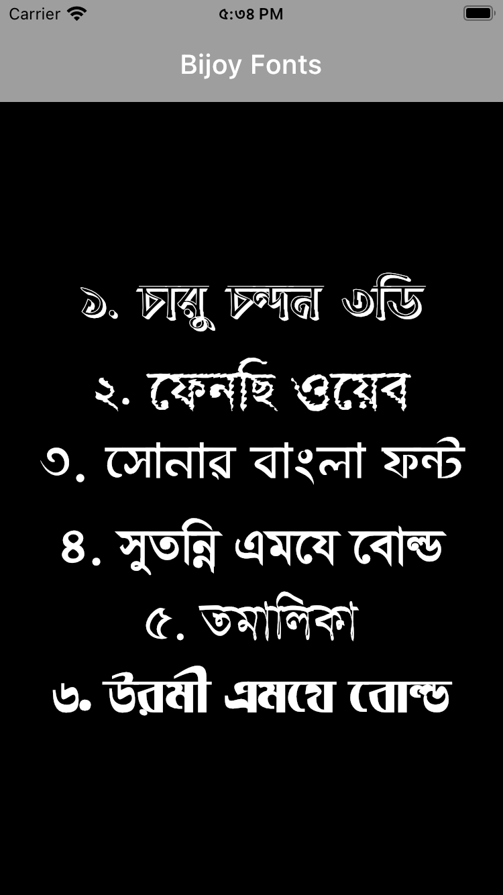

&nbsp;&nbsp;
&nbsp;&nbsp;
<a href="https://choosealicense.com/licenses/mit/" target="_blank"></a>&nbsp;&nbsp;


# Flutter Fonts

</img>
This repo will teach you how to use custom fronts that are available on the internet.<br>
Detailed description of how to use them properly in your applications are available [here](https://docs.flutter.dev/cookbook/design/fonts).
<br>

```
Flutter supports the following font formats:
1) .ttf
2) .otf
```

<br>
The Bijoy fonts are downloaded from [okkhor52.com](https://okkhor52.com/)
<br><br>
*** Note: Flutter does not support .woff and .woff2 fonts for all platforms. ***

## Screenshots

<p align="center">
</img>
&nbsp;&nbsp;&nbsp;&nbsp;
</img>
</p>

## Bijoy Fonts to Unicode Converter [CONVERTER](https://bsbk.portal.gov.bd/apps/bangla-converter/index.html)

<p align="center">
</img>
</p>
